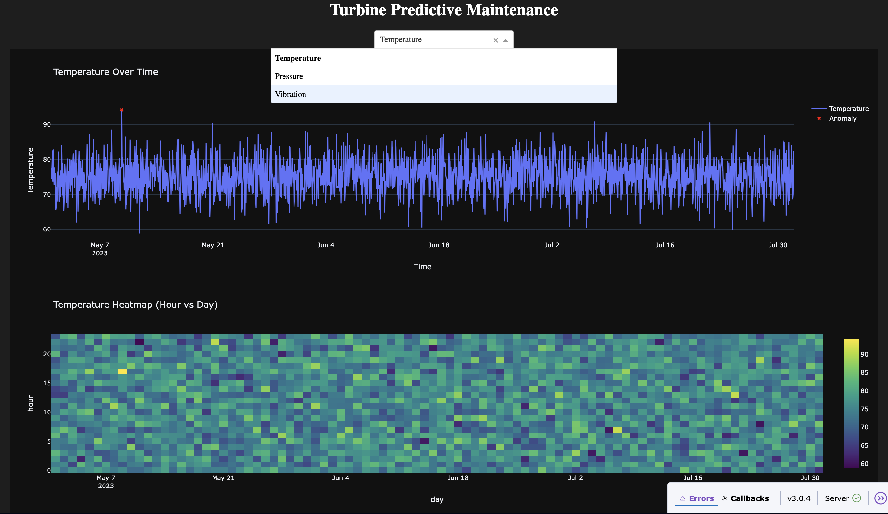
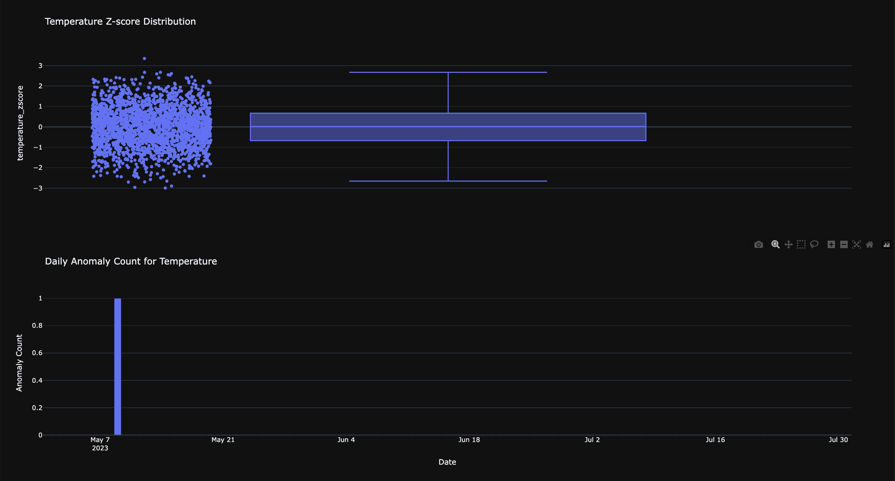
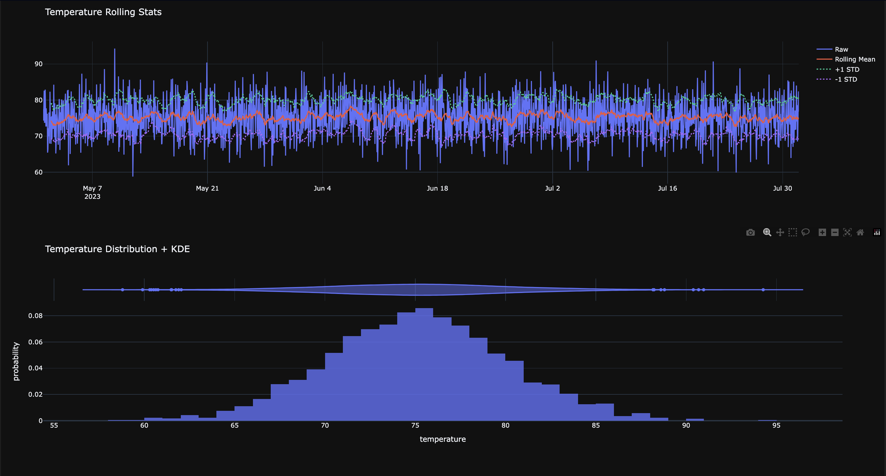
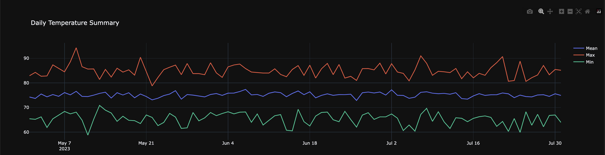

# Turbine Predictive Maintenance Dashboard

An interactive dashboard for monitoring turbine sensor data with anomaly detection, KPI tracking, and intuitive visualizations. Built using **Dash**, **Plotly**, and **Pandas**, this project is designed to support data-driven maintenance decisions in industrial environments.

---

## Features

- **Anomaly Detection**: Rolling Z-score technique highlights outliers in temperature, pressure, and vibration data.
- **Multi-Sensor Trend Analysis**: Spline-based time-series plots with overlaid anomaly markers.
- **Calendar Heatmaps**: Visualize hourly sensor activity across days using thermal-style density grids.
- **Statistical Summaries**: Box plots and KDE-enhanced histograms reveal sensor behavior distribution.
- **Rolling Mean Visualization**: Includes ±1 STD band for smoothed monitoring of sensor stability.
- **KPI Dashboard**: Daily minimum, maximum, and mean values tracked over time.
- **Dark Themed UI**: Built-in Plotly dark mode for modern visualization aesthetics.
- **Interactive Controls**: Sensor selection dropdown to toggle views on demand.

---

## Architecture

```plaintext
CSV Data (turbine_sensor_data.csv)
   • timestamp
   • temperature
   • pressure
   • vibration

Backend: Python
  • pandas for time-series preprocessing
  • numpy for statistical thresholds

Frontend: Dash + Plotly
  • Modular graphs with dynamic callbacks
  • Interactive dropdowns and layout styling
```
## Preview







